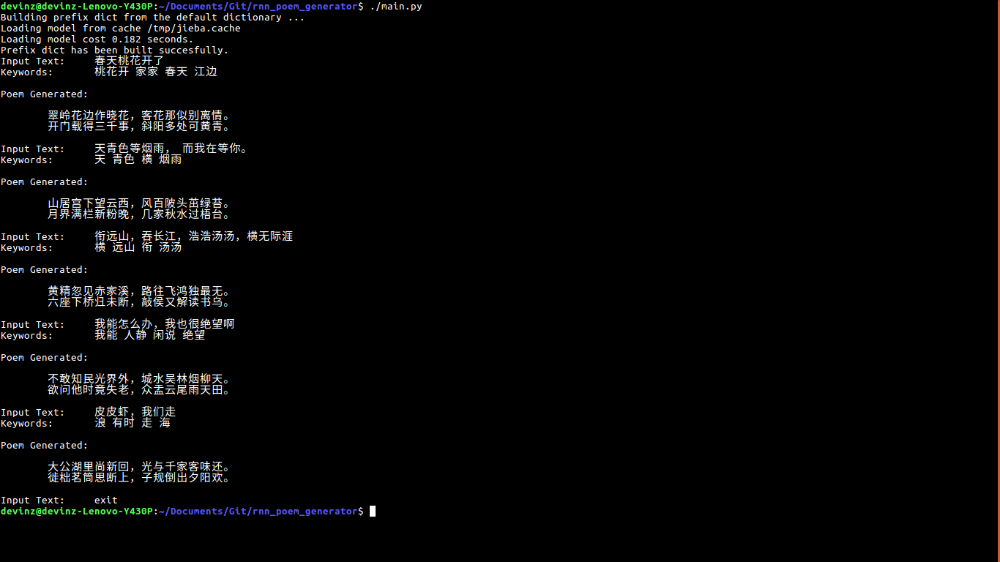

# Chinese Poetry Generation

This is our course project for CSCI 544 at USC.

We have implemented two Chinese poem generators using two different methods.

I. [rule\_based/](rule_based/) is a poem generator based on a trained word model and predefined format constraints.

II. [rnn\_based/](rnn_based/) is a poem generator based on the RNN encoder-decoder framework.

